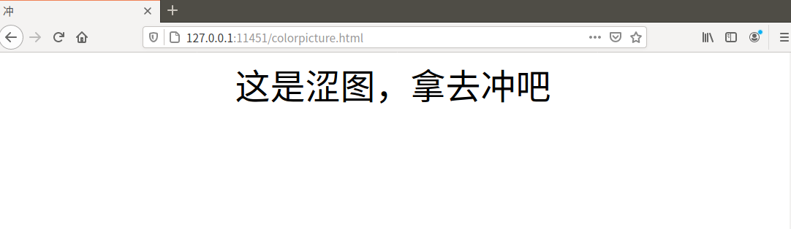

# TinyWebServer

Linux 下使用 C++ 实现的简易的 Web 服务器

+ 半同步/半反应堆线程池
+ 事件处理模式：reactor
+ 简易的压力测试

封装了如下类

```bash
.
├── config.h                #配置文件
├── http
│   ├── httpcon.cpp
│   ├── httpcon.h           #连接类
│   ├── httprequest.cpp
│   ├── httprequest.h       #解析请求报文
│   ├── httpresponse.cpp
│   └── httpresponse.h      #组装响应报文
├── locker
│   └── locker.h            #简单的同步机制类
├── main.cpp
├── threadpool
│   ├── taskQueue.h         #任务队列
│   └── threadpool.h        #线程池
├── toys
│   ├── buffer.cpp
│   ├── buffer.h            #输入输出缓冲
│   ├── etEpoll.cpp
│   ├── etEpoll.h           #epoll
│   ├── tcpsocket.cpp
│   └── tcpsocket.h         #tcpSocket
└── webserver
    ├── webserver.cpp
    └── webserver.h         #主线程
```

+ ## 压力测试

通过下方链接下载 webbench

http://home.tiscali.cz/~cz210552/webbench.html

安装

`sudo make && sudo make install PREFIX=your_path_to_webbench`

运行

`./webbench -c 1000 -t 10 http://127.0.0.1:11451/`

虚拟机上跑的，操作系统 18.04.1-Ubuntu；内存 4G，CPU 8 核 i7-7700HQ，webbench 客户端数 -c 10000 电脑直接卡死。。遂放弃


+ ## 效果

GET 解析及响应


POST 解析及响应



+ ## TODO

>+ 图片以及视频文件（二进制文件）的传输
>+ 计时器
>+ 日志
>+ 优化输出，可以将文件缓存到内存，每个连接可以维护一个指针而不是一大串文本